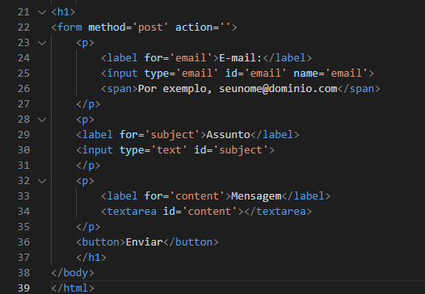

# Projeto de Formulário

## Código

 

## Fontes utilizadas
O site utilizado foi o [Mozilla](https://developer.mozilla.org/en-US/docs/Web/HTML/Element/form)

## Tecnologias utilizadas

* HTML5
* Git Hub

# Elementos e atributos do Formulário 
## Form
O elemento HTML `<form>` representa uma seção do documento contendo controles interativos para envio de informações, esse elemento é quem formalmente define o formulário e os atributos que definem a maneira como esse formulário se comporta.

Ex. Como podemos ver no arquivo HTML, na linha 22, nos parágrafos acima:

## Label 

O elemento HTML `<label>` representa uma legenda para um item em uma interface de usuário. Um elemento `HTML <label> `representa uma legenda para um item em uma interface de usuário. Ele pode estar associado com um elemento de controle, colocando este dentro do elemento label, ou usando o atributo for. Tal controle é chamado o controle etiquetado do elemento etiqueta. Um input pode ser associado a diversas etiquetas `(<label>s)`.

Ex. Na imagem do arquivo HTML, nas linhas 24, 29 e 33:

## Input

O elemento HTML `<input>` é usado para criar controles interativos para formulários baseados na web para receber dados do usuário. A semântica de um `<input>` varia consideravelmente dependendo do valor de seu atributo type.

Ex. Como vemos na imagem do HTML, nas linhas 25 e 30.

## Span

O elemento HTML `` é um conteiner generico em linha para conteúdo fraseado , que não representa nada por natureza. Ele pode ser usado para agrupar elementos para fins de estilo (usando os atributos class ou id ), ou para compartilhar valores de atributos como lang. Ele deve ser usado somente quando nenhum outro elemento semântico for apropriado. `` é muito parecido com o elemento `
` , entretando `
` é um elemento de nível de bloco enquanto `` é um elemento em linha.

Ex. Como podemos ver na imagem de HTML, na linha 26:

## Textarea 

O elemento HTML `<textarea>` representa um controle de edição para uma caixa de texto, útil quando você quer permitir ao usuário informar um texto extenso em formato livre, como um comentário ou formulário de retorno.

Ex. Na imagem HTML, na linha 34:

## Method

O atributo `<method>` especifica como enviar dados de formulário (os dados de formulário são enviados para a página especificada no atributo action). Os dados do formulário podem ser enviados como variáveis ​​​​de URL (com method="get" ) ou como pós-transação HTTP (com method="post" ).

Ex. Na imagem do HTML, na linha 22:

## Action

O atributo `<action>` define o local (uma URL) em que os dados recolhidos do formulário devem ser enviados. O atributo method define qual o método HTTP para enviar os dados (ele pode ser "GET" ou "POST" (veja as diferenças aqui).

Ex. Como vemos na imagem HTML, na linha 22: 

## P

O elemento HTML 
 representa um parágrafo. Em mídias visuais, parágrafos são representados como blocos indentados de texto com a primeira letra avançada e separados por linhas em branco. Já em HTML, parágrafos são usados para agrupar conteúdos relacionados de qualquer tipo, como imagens e campos de um formulário.

Ex. Na imagem do HTML, nas linhas 23, 27. 

## For

O atributo `<for>` faz um tipo de link entre a label e o input . Logo o for tem que apontar para o ID do input . Outra forma de uso é que vc pode fazer vários tipos de customização pelo CSS escondendo o input default do browser por exemplo e usando a própria label como se fosse o botão.

Ex. Como na imagem HTML, 24:

## Type

O `<type>` indica o tipo de texto do código.

Ex. Como na imagem do HTML, na linha 30: 

## Id

O atributo global `<id>` define um identificador exclusivo (ID) que deve ser único por todo o documento. Seu objetivo é identificar o elemento ao navegar por âncoras (usando um identificador de fragmento), quando utilizar scripts ou estilizando (com CSS).

Ex. Na imagem do HTML, nas linhas 25 e 30: 

## Name

O `<name>` é um atributo muito importante para os campos do tipo input. Ele serve para identificar o valor daquela variável no nosso backend.

Ex. Na imagem HTML, na linha 25:

## Button

O elemento `<button>` indica um botão clicável.

Ex. Como na imagem do HTML, na linha 36. 

